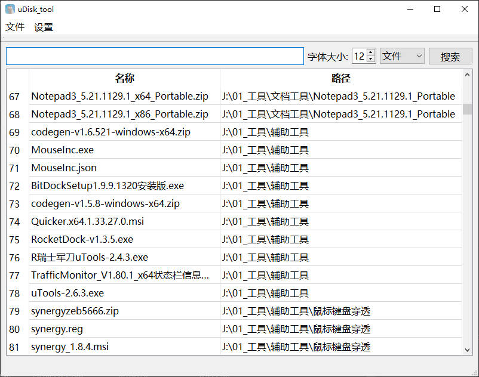
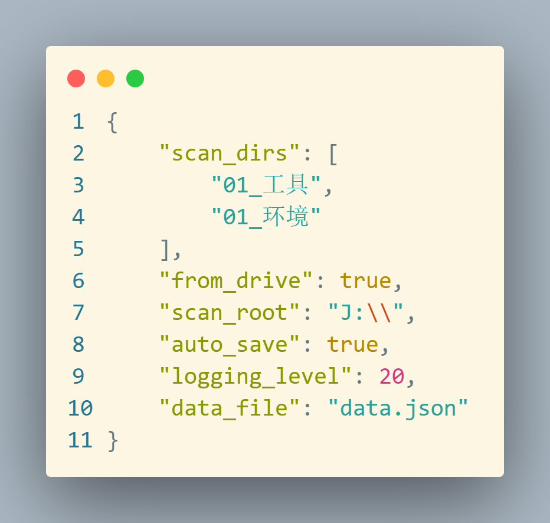
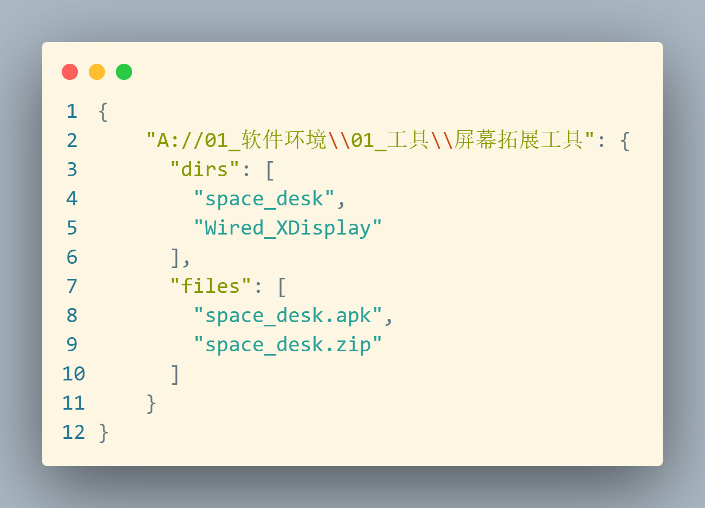

# uDisk_tool

U盘文件搜索工具 

初衷: 方便更快找到U盘中的所需工具

### 软件界面

### 功能

- 支持按文件、文件夹、后缀名搜索文件
- 支持自定义搜索路径
- 支持双击打开文件, 右键打开文件所在位置
- 支持更改字体

### 配置文件

setting.json

- scan_dirs: 要扫描的文件夹
- from_drive: 从驱动器开始扫描
- scan_root: 扫描的根路径, 如果from_drive为true则忽略此路径, 而是从驱动器根路径开始扫描
- auto_save: 设置信息修改后自动保存
- logging_level: 日志记录等级, 10-debug, 20-info
- data_file: 索引信息记录文件

### 索引信息文件

- key: 父路径
- dirs: 父路径下的文件夹
- files: 父路径下的文件
- 下一key为当前key/dirs[0]